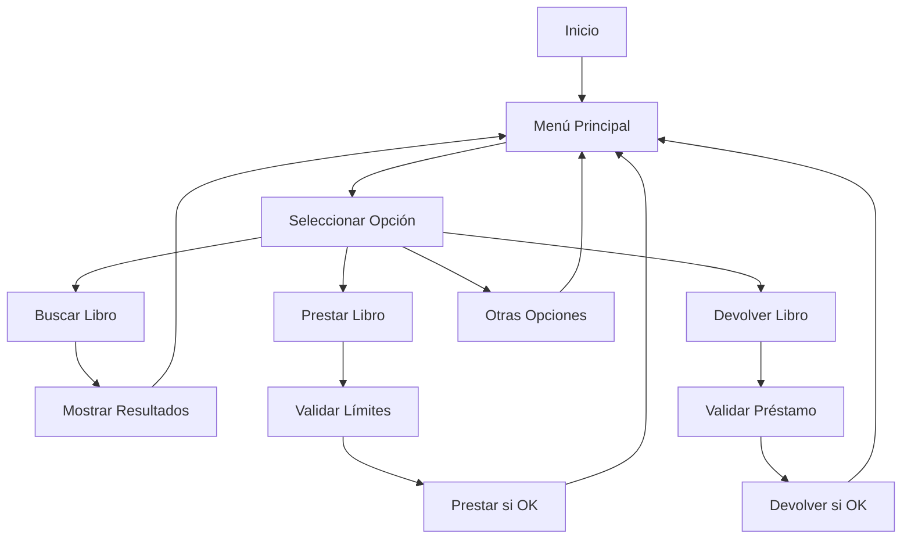

# 🏛️ Sistema de Gestión de Bibliotecas

**Proyecto Final del Curso - Aplicación de Consola C# .NET 9.0**

## 📋 Descripción

Esta aplicación implementa un sistema completo de gestión de bibliotecas que permite:

- ✅ **Buscar libros por título** (búsqueda parcial)
- ✅ **Limitar préstamos** (máximo 3 libros por usuario)
- ✅ **Gestión de devoluciones** con validaciones
- ✅ **Administración automática de usuarios**
- ✅ **Seguimiento completo del estado de préstamos**

## 🎯 Funcionalidades Implementadas

### 1. Búsqueda de Libros
- Búsqueda por título completo o parcial
- Insensible a mayúsculas/minúsculas
- Muestra disponibilidad en tiempo real

### 2. Sistema de Préstamos con Límites
- Límite de **3 libros por usuario** simultáneamente
- Validación automática antes del préstamo
- Registro de fecha y usuario del préstamo
- Creación automática de usuarios nuevos

### 3. Gestión de Devoluciones
- Validación de que el libro esté prestado
- Verificación de que el usuario correcto devuelve el libro
- Actualización automática del estado y disponibilidad

### 4. Características Adicionales
- Colección predefinida de 8 libros para pruebas
- Estadísticas del sistema en tiempo real
- Interfaz de usuario intuitiva con menús claros
- Manejo robusto de errores y validaciones
- Mensajes informativos con iconos emoji

## 🚀 Cómo Ejecutar

### Prerrequisitos
- .NET 9.0 SDK instalado
- Terminal o línea de comandos

### Ejecución
```bash
# Navegar al directorio del proyecto
cd SistemaGestionBiblioteca

# Compilar y ejecutar
dotnet run
```

## 📖 Guía de Uso

### Menú Principal
1. **Buscar libro por título** - Encuentra libros en la colección
2. **Prestar libro** - Asigna un libro a un usuario (máximo 3)
3. **Devolver libro** - Registra la devolución de un libro prestado
4. **Agregar nuevo libro** - Expande la colección
5. **Ver todos los libros** - Muestra el catálogo completo con estados
6. **Ver usuarios y préstamos** - Lista usuarios y sus libros prestados
7. **Ver estadísticas** - Resumen del sistema (ocupación, usuarios, etc.)
8. **Ayuda** - Información detallada del sistema
9. **Salir** - Cierra la aplicación

### Ejemplos de Uso

#### Buscar un Libro
```
🔍 BUSCAR LIBRO POR TÍTULO
------------------------------
Ingrese el título del libro: quijote
✅ Se encontraron 1 libro(s) que contienen 'quijote':
ID: 1 | El Quijote por Miguel de Cervantes | ISBN: 978-84-376-0494-7 | Estado: DISPONIBLE
```

#### Prestar un Libro
```
📚 PRESTAR LIBRO
----------------
Ingrese el ID del libro: 1
Ingrese el nombre del usuario: Juan
✓ Libro 'El Quijote' prestado exitosamente a Juan
  Libros disponibles para Juan: 2
```

#### Devolver un Libro
```
📖 DEVOLVER LIBRO
-----------------
Ingrese el ID del libro: 1
Ingrese el nombre del usuario: Juan
✓ Libro 'El Quijote' devuelto exitosamente por Juan
  Libros disponibles para Juan: 3
```

## 🏗️ Arquitectura del Proyecto

```
SistemaGestionBiblioteca/
├── Models/
│   ├── Libro.cs           # Modelo de datos del libro
│   └── Usuario.cs         # Modelo de datos del usuario
├── Services/
│   └── BibliotecaService.cs # Lógica de negocio principal
├── UI/
│   └── MenuUI.cs          # Interfaz de usuario
└── Program.cs             # Punto de entrada principal
```

### Patrones Implementados
- **Separación de Responsabilidades**: Modelos, servicios y UI separados
- **Principio de Responsabilidad Única**: Cada clase tiene una función específica
- **Manejo de Errores**: Try-catch en operaciones críticas
- **Validaciones**: Verificaciones en todas las entradas de usuario

## 🔧 Características Técnicas

- **Framework**: .NET 9.0
- **Lenguaje**: C# 12
- **Tipo**: Aplicación de Consola
- **Arquitectura**: Separación por capas (Models, Services, UI)
- **Gestión de Memoria**: Uso eficiente de colecciones genéricas
- **Encoding**: UTF-8 para soporte de caracteres especiales

## 📊 Datos de Prueba

La aplicación viene preconfigurada con estos libros:

1. **El Quijote** - Miguel de Cervantes
2. **Cien años de soledad** - Gabriel García Márquez  
3. **1984** - George Orwell
4. **El Principito** - Antoine de Saint-Exupéry
5. **To Kill a Mockingbird** - Harper Lee
6. **The Great Gatsby** - F. Scott Fitzgerald
7. **Pride and Prejudice** - Jane Austen
8. **The Catcher in the Rye** - J.D. Salinger

## 🎯 Cumplimiento de Objetivos

### ✅ Requisitos Completados

1. **Función de búsqueda**: Implementada con búsqueda parcial por título
2. **Límite de préstamos**: Máximo 3 libros por usuario con validaciones
3. **Devolución de libros**: Sistema completo con verificaciones
4. **Validaciones robustas**: Manejo de errores en todas las operaciones
5. **Interfaz amigable**: Menús claros con iconos y colores
6. **Funcionalidades adicionales**: Estadísticas, gestión de usuarios, etc.

### 🔄 Flujo de Operaciones



## 👨‍💻 Desarrollo

Este proyecto fue desarrollado siguiendo las mejores prácticas de programación en C#:

- Nomenclatura consistente y descriptiva
- Comentarios XML en métodos públicos
- Separación clara de responsabilidades
- Manejo apropiado de excepciones
- Validación exhaustiva de entradas de usuario

---

**Desarrollado como proyecto final del curso de programación**
*Sistema completo de gestión de bibliotecas con funcionalidades avanzadas*
